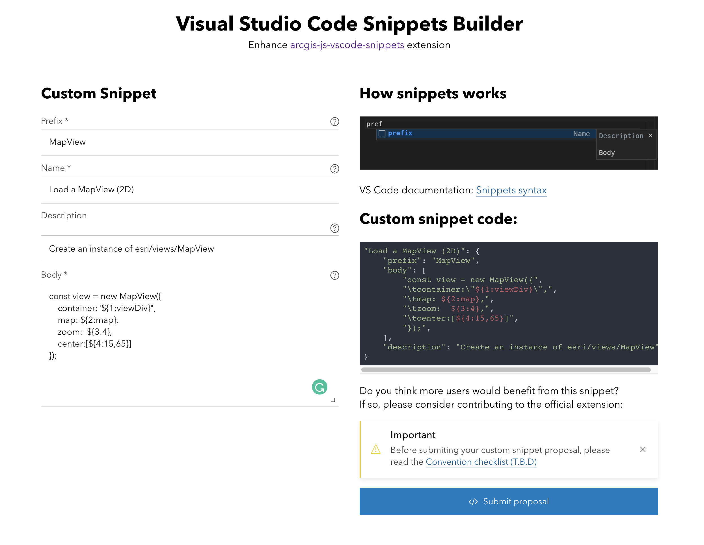

# VS Code snippets builder

This application will help and guide you in the process of writing your own [Snippets in Visual Studio Code](https://code.visualstudio.com/docs/editor/userdefinedsnippets). You can use it to create your own custom user snippets or to contribute to [arcgis-js-vscode-snippets](https://github.com/Esri/arcgis-js-vscode-snippets/blob/master/contributing.md).

[Live demo](https://hhkaos.github.io/vscode-snippets-builder/)

